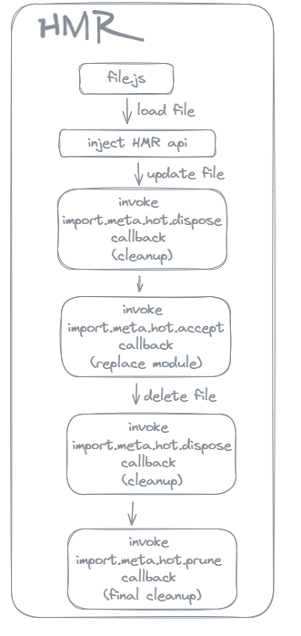
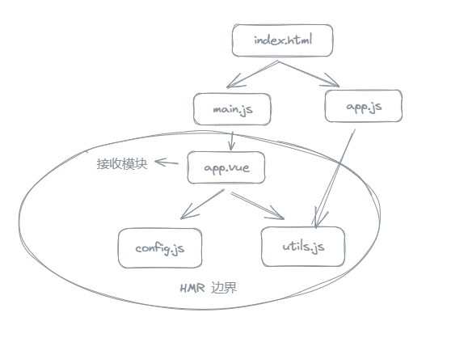

# vite-hmr-demo

由于关于 hmr 相关的资料太少了，因此参考 [esm-hmr](https://github.com/FredKSchott/esm-hmr) 及 [vite](https://github.com/vitejs/vite) 中规范，手动实现了一个简易的 ESM-HMR 实例。

## 什么是 HMR

HMR 简单来说就是在 app 运行的时候替换模块。大多数打包器使用的都是 ECMAScript 模块（ESM）作为项目中的模块基础，因为它非常容易分析出导入（imports）、导出（exports），这就使得非常容易知道一个模块在变动会影响到哪些模块。

> 使用 [es-module-lexer](https://www.npmjs.com/package/es-module-lexer) 分析模块的导入导出。


只有使用提供的 HMR api 才能实现热更新。



## HMR api

#### import.meta.hot.accept

在文件中添加 import.meta.hot.accept，文件变动相关的信息才会发送给客户端，而我们需要在回调里自定义模块更新的逻辑。包含这些 api 的文件被称为 "接受模块（accepted modules）"

一个接受模块会创建一个所谓的 HMR 边界（boundary）。HMR 边界递归地包含模块本身及其所有导入的模块。模块在代码中使用视图（moduleGraph）的结构表示，因此接受模块也是 HMR 边界的根。



通过给 import.meta.hot.accept 不一样的传参，一个接受模块可以将范围缩小为当前模块，这种模块被为“自我接受模块（self-accepted module）”。import.meta.hot.accept 在本仓库中为了简便只支持一种传参方式：

- import.meta.hot.accept(deps: string[], cb: Function)：接受导入文件的变动（不包括自身文件），导入的文件发送了变动，服务端发送过来的变动文件信息会传到当前文件的 cb 函数中。当 deps 数组为空数组时，只接受文件自身的变动，也就是自我接受模块。

import.meta.hot.accept 方法使用示例：

```js
// utils.js
export let number = 1;

// app.js
import { number } from './utils.js'
document.querySelector('#value').textContent = number

if (import.meta.hot) {
  // 在 import.meta.hot.accept 回调中实现热更新逻辑
  import.meta.hot.accept(['./utils.js'], ([newModule]) => {
    // 使用新值重新渲染
    document.querySelector('#value').textContent = newModule.value
  })
}
```

#### import.meta.hot.dispose

当一个接受模块或者一个被导入模块被替换成一个新的模块或者正在被删除、不在导入时，我们可以使用 import.met.hot.dispose() 执行清理。这允许我们清除旧模块创建的任何副作用，例如删除事件侦听器、清除计时器或重置状态。

```js
// 定时器
let interval = setInterval(() => {
  // ...
}, 10000);
// 全局变量
globalThis.__private_data = {
  // ...
}

if (import.meta.hot) {
  import.meta.hot.dispose(() => {
    // 重置变量
    globalThis.__private_data = {}
    // 移除定时器
    clearInterval(interval);
  })
}
```

#### import.meta.hot.invalidate

跟上面的 api 不同的是，import.meta.hot.invalidate 是一个方法而非生命周期的钩子。通常是在 import.meta.hot.accept 回调中使用，当我们意识到模块热更新可能不安全的时候需要放弃此次的更新就可以使用这个方法。

这个方法只能在接受模块（定义了 import.meta.hot.accept）中使用，当模块内不能处理 HMR 更新时，需要将这次的更新强制传递给导入者（通过 import 导入该模块的其他模块），通过调用 import.meta.hot.invalidate()， HMR 服务将使模块调用方的导入失效，就像接受模块中并非接受自身一样（没有设置 import.meta.hot.accept 或者 accept 中的第一个参数设置了接收依赖），并重新执行 HMR 冒泡来查找哪个导入者可以接收这次的改变。

```js
// utils.js
export let number = 1

if (import.meta.hot) {
  import.meta.hot.accept((newModule) => {
    // 如果 number 变量不再导出、值改动了或者重命名了，因为设置了 accepted，当前模块就是 HMR 的边界，变动只会传递到这里为止，不会通知这个模块的其他导入者
    if (!(number in newModule) || newModule.number !== 1) {
      // 重新执行 HMR 冒泡
      import.meta.hot.invalidate()
    }
  })
}

// app.js
import { number } from './utils.js'
document.querySelector('#value').textContent = number

if (import.meta.hot) {
  import.meta.hot.accept(['./utils.js'], ([newModule]) => {
    // 使用新值重新渲染
    document.querySelector('#value').textContent = newModule.value
  })
}
```

像这个例子，在 utils.js 导出一个 number，文件本身是不知道这个 number 被其他文件用来干什么，因此需要通知导入者进行更新。
